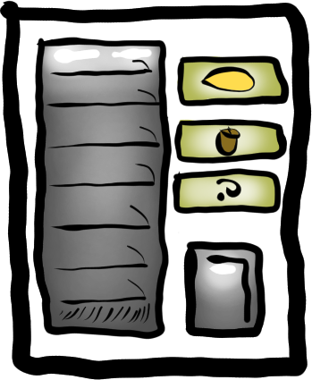
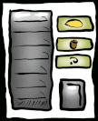
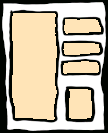
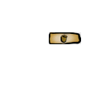
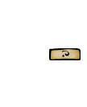
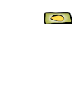
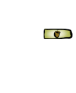
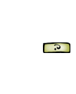

### The Plan

// DIRECTION: What will we be doing, and how?

The plan is for a vending machine with a limited amount of stuff inside it.

Before now, we've been using the lemon sprite shipped with Docking Station.

However, a guide that goes further in-depth into RAL features requires a more complex agent.

As such, the agent that will be created is a vending machine.

This vending machine will hold 7 of a mixture of Talking Lemons and Justanuts, visible in the left area.

The player will be able to click on buttons to either dispense one, or to randomly dispense either. It is possible that the vending machine will run out of a given type of object, in which case that will no longer be available.

This vending machine will be a single agent, but will use compound agent parts to animate the products being pushed off the racks and falling to the tray, where they will then be moved to the dispensing area (where the actual product agent will be spawned).

The file `ral_vending_machine.c16` should have been supplied in the `samples` directory of your copy of RAL. Please copy it to your Images directory.

To help with understanding how this will work in practice, the frames of the vending machine sprite are shown below.

[.text-center]
_The vending machine (original drawing)._

#### `ral_vending_machine.c16`

[.text-center]
_Frame 0: The vending machine sprite, scaled down to the intended in-game resolution, with minor adjustments made to the border._

[.text-center]
_Frame 1: The front panel of the vending machine, as an overlay so that other sprites display under it. Shown on a cream background for clarity._

[.text-center]
_Frame 2: Lemon button, red._

[.text-center]
_Frame 3: Justanut button, red._

[.text-center]
_Frame 4: Random button, red._

[.text-center]
_Frame 5: Lemon button, green._

[.text-center]
_Frame 6: Justanut button, green._

[.text-center]
_Frame 7: Random button, green._
