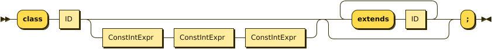
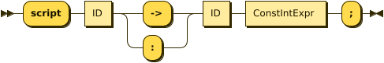

### Declarations

Declarations are the basic element of a RAL source file.
Everything else is defined inside declarations.


#### Includes/etc.

##### include

`include` includes a file, found either relative to the current file, or in the set of search paths.

By default, the only search path is the Standard Library - more can be added with `addSearchPath`.

If a file is included more than once, the second and onward includes are ignored.

```
include "std/c3.ral";
```


##### addSearchPath

Adds a search path for `include`. If the search path is relative, then it is relative to the current source file.

_It is expected that this does not play well with tooling such as the RAL language server (as when editing whatever files you included, that file doesn't have the added search path) -- this has been kept as ultimately it may be a useful tool to "just get code working" without having to do too many adjustments._

```
addSearchPath "../evilcorpCoreLibraries";
include "eccl/elo.ral";
```


#### Type System

##### typedef

`typedef` defines a name for a type.

This is usually useful to name unions.

```
typedef number integer|float;
```


##### class

`class` defines a name for a classifier in the Family/Genus/Species tree of the Scriptorium.

In addition, `extends InterfaceName` may be added an arbitrary amount of times, to indicate the class supports some interfaces.

*Be wary to avoid a situation where fields and messages will overlap. If the compiler detects this, it will error, and if it doesn't, then it is not certain which definition will "win".*

```
class Canary 2 13 3987 extends Bird;
```



##### interface

`interface` defines an interface, a set of message/script numbers and fields that may be attached to a `class`.

In addition, `extends InterfaceName` may be added an arbitrary amount of times, to indicate that supporting this interface implies supporting some other interfaces, or that this interface implies extending a class (this has it's uses, as interfaces are types).

```
interface Bird extends GoodBug;
```


##### field

`field` defines a field on a class or interface.

It consists of a field type, the class/interface name, `.` (indicating field access), the field name, and finally the Object Variable number.

For example, `ov00` would be `0`.

Example:

```
field string Canary.tweetText 1;
```


##### message

`message` declares a message on a class or interface.

It consists of a message-ID-of expression (i.e. `Agent->someMessage` or `Agent:someMessage`) followed by the message number.

*At some point explicit type declarations for parameters may become a thing, but not presently.*

```
message Canary:tweet 1000;
```


##### script (declaration form)

`script` in it's declaration form is usually equivalent to `message`, except where `messageHook` is in play.

As such, see `message` for syntax. You should only see this in the standard library.



##### overrideOwnr

This is used in the standard library to mark specific script numbers that the engine misuses in colourful ways, in particular 101 through 105.

In this event, what would usually be the type of `ownr` is moved to `from`, and the type of `ownr` is set to the one given.


##### messageHook

This is used in the standard library to mark those message numbers which the engine does not treat as equivalent to script numbers.

This causes RAL to not automatically create script definitions for message definitions and vice versa.

```
messageHook 0;
script Agent:scrDeactivated 0;
message Agent:msgActivate1 0;
```


##### assertConst

`assertConst` asserts that the given constant boolean is true.

This assertion occurs at compile-time and thus is very limited in what it will accept.

This is mainly useful as a debugging tool.

```
assertConst 1; // valid
assertConst 0; // error
```


##### Constants

A constant can be declared with the syntax `myConst = 1;`.

The expression must be evaluatable at compile-time at the point of declaration - almost needless to say, this sets quite a few limits on what is permitted. However, there is enough flexibility present for useful.

*Be aware that constants overrule in-scope variable declarations. This is to ensure consistency, as the parser and evaluator do not have access to information about scope.*

```
myConst = 1;
alwaysFalse = 0;
install {
    @'outv {myConst}';
    if alwaysFalse {
        @'outs "This code will never be run!"';
    }
}
```

image::diagram/ConstantDecl.png[]

#### Code

##### script (statement form)

`script` in it's statement form declares a script.

RAL only allows declaring scripts on named classes (not that this is particularly hard to ensure - classes may be named with the `class` declaration).

The script may be specified as `Class:scriptName` or as `Class 123` (where 123 is the script number, declared with `message` or `script` as appropriate).

It is generally preferrable to use script names.

```
script Canary:eaten {
@'dbg: outs {"Ouchie!"}';
}
```


##### install

`install` declares the install script of an agent, used to place it in the world.

The keyword, `install`, is simply followed by a statement/block. *If multiple install sections are declared, the contents of each are merged into one big install section in the order of their declaration.*

```
install {
newSimple(Canary, "canary.c16", 1, 0, 3000);
}
```


##### remove

Like `install`, `remove` declares a global script - however, the remove script is intended to clean up the agent's Scriptorium presence, along with the agent itself.

The keyword, `remove`, is simply followed by a statement/block. *If multiple remove sections are declared, the contents of each are merged into one big remove section in the order of their declaration.*

```
remove {
scrx(Canary, Canary:tweet);
}
```


##### macro

It is reasonably evident to a programmer who has had to read any significant amount of CAOS (the Portal code is great for shredding your soul) that the lack of global named functions with arbitrary amounts of arguments in CAOS... or global named functions... or global functions... is a severe drain on the sanity of anyone with the misfortune of having to work in it.

As such, RAL includes macros, meant to act as the RAL equivalent to global functions.

In practice, RAL macros are expressions with parameters that are either aliased or copied into temporary variables.

There are two forms of macro: Statement macros and expression macros.

Both become callable expressions, but statement macros have their 'return' values aliased as accessible variables that you write to, while expression macros are simply a substitution of an expression (but see *statement expressions* in the relevant section).

The syntax of an expression macro is simply `macro NAME(PARAM...) EXPRESSION`.

It is polite to append a semicolon after an expression macro that is not a *statement expression*.

Parameters are separated by `,` and take the form of `TYPE NAME`, `TYPE @NAME`, or `TYPE @=NAME`. The presence of the `@` character, declaring the parameter as inline, is invalid (and redundant) for the return values of a statement macro, but for regular (non-return) parameters it's always valid. The `@=` variant indicates the parameter is inline and variable (it must be assignable to).

Essentially, the difference is that an inline parameter is declared as if an `alias` had occurred in a scope immediately surrounding the call, while a non-inline parameter is declared as if a `let` had occurred in that same scope.

The syntax of a statement macro is `macro (RET...) NAME(PARAM...) STATEMENT`, where `RET` is of the same format as `PARAM` but without inlining being allowed (as it's redundant - all return values are inline).

It is allowed to declare multiple macros with the same name if and only if they have a different number of parameters.

```
macro textWithSideEffects() {
@'outs {"Side effect!\n"}';
return "Bloop.";
}

macro test1(str text) {
// As the argument is not inline, a temporary variable is created.
// Thus the side effects only execute once.
@'outs {text}';
@'outs {text}';
return 1;
}

macro (int retVal) test2(str @text) {
// As the argument is inline, 'text' here is substituted for the expression.
// Thus the side effects execute twice.
@'outs {text}';
@'outs {text}';
// Note that if there are any side-effects necessary in order to write to retVal, they occur here.
retVal = 1;
}

macro () test3(str @=text) {
// Inline variable arguments can also effectively return values.
text = "someText!\n";
}

install {
test1(textWithSideEffects());
test2(textWithSideEffects());
// v is modified here by test3.
let string v;
test3(v);
@'outs {v}'; // someText!\n
}
```


__ArgList__:


__MacroArg__:

image::diagram/MacroArg.png[]
