## RAL Language Reference: Statements

Statements are the unit of sequenced, non-value-returning code in RAL.

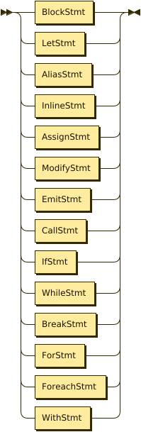

### Scoping

#### Blocks

Blocks are one of the most basic kinds of statement, made up of `{}` surrounding other statements. Blocks separate scopes, and allow multiple statements to be written in any place a single statement can be written.

```
{
let int counter = 0;
}
// counter = 1; // would error, counter doesn't exist here
```

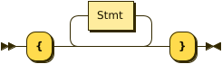

#### let

`let` is used to introduce variables in the current scope.

A `let` statement is made up of individual variable declarations, followed optionally by an assignment.

Each variable declaration is an ID with a type possibly preceding it, for example `Agent? stinger` or `stinger`.

A variable definition may also have `@` followed by a number after it -- this is to force the use of a specific VA slot for the variable. _Allocating a variable that RAL has already chosen to use is an error, so allocate variables as early as possible if you're going to do this -- ideally at the beginning of a script._

Variable definitions are separated by commas `,` and are terminated with the semicolon `;` or the assignment `=`.

If a variable declaration does not have a type, the type is the type of what is being assigned to it.

```
let int counterA = 0;
let counterB = 0; // type is automatically int
let counterC = 0.0; // type is automatically float
// let int counterD = 0.0; // error, implicit casts float to int
let Agent? a, Agent? b = null, null; // multiple definition

let int something@5; // allocates va05 specifically
```


__LetStmtBody__:

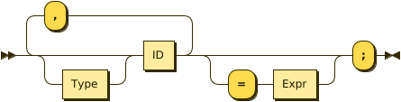

#### alias

`alias` is used to retype variables, provide different names for them, or outright treat complex expressions as simple variables (re-run on every use, mind).

It also works nicely as a teaching mechanism for the "odd" parts of RAL macros.

`alias` comes in two forms: A "normal" variant and a "cast" variant.

The normal variant is of the form `alias variable = source;` and aliases an ID to an arbitrary expression. This can be considered like a "mini-macro". For typing and scope purposes the expression is resolved at the point of the `alias`, but the values of variables are those at the point where the ID is used.

The cast variant is of the form `alias variable!Type;` and aliases a variable to itself cast to a given type, equivalent to `alias variable = variable!Type;`.

The most useful application of `alias` is when you need to update the type of `targ` (i.e. because of `rtar`)

```
let num a = 0;
alias b = a; // normal variant
alias a!float; // cast variant - alter 
```

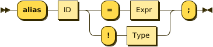

### Actions

#### Inline Statements

Inline statements, or `&`, are used to reasonably-directly write CAOS into the output.

These statements start with `&`, followed by string-embeds containing the CAOS code, and finally ending with a semicolon (`;`).

```
// Inline statements may contain expressions.
let int number = 0;
&'outv {number + 1}';
// Inline statements may be written over multiple string-embeds.
&'outs {"Now is the time\n"}\n'
 'outs {"For all good Norns\n"}\n'
 'outs {"To respect the buzzing of the airlock\n"}';
```


#### Expression Statements and Assignment Statements

Assignment statements assign some expressions to some other expressions.

Expression statements are like assignment statements, but no assignment has been specified, so the necessary amount of discard variables are created and the expression is "assigned" to these variables.

```
1 + 1; // Expression statement, runs the calculation but discards the result
a(); // Expression statement for macro call
counter = 5; // Assignment statement
counter = counter + 4;
xPos = posx(); // Assignment statement with macro call
xPos, yPos = getRandomXY(); // Assignment statement with multiple return values
```

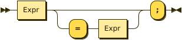

#### Modify-Assignment Statements

Modify-assignment statements are a shorthand for certain assignment statements.

They cover: `+=` (add), `-=` (subtract), `*=` (multiply), `/=` (divide), `|=` (or), `&=` (and).

These represent the relevant operators.

```
let counter = 1;
counter += 1; // counter is now 2
```

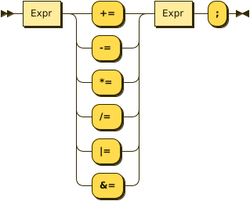

#### Emit Statements

Emit statements are of the form `receiver->messageName([arg1[, arg2]])[ after ticks];`, where `receiver`, `messageName`, `arg1`, `arg2`, and `ticks` are changed as appropriate. This becomes a `MESG WRIT` or `MESG WRT+` as appropriate.

Remember that emit statements send messages that are queued, and are not executed immediately.

```
alias targ!Boopable; // for messages
targ->receivedBoop();
```

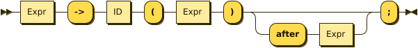

#### call

`call` represents a `CALL` rather than a `MESG WRIT`, occurring on the owner and suspending the current script until completion - it is otherwise like an emit statement.

```
call makeBoopNoises();
```


### Flow Control

#### if

`if` is a conditional branch statement. It is of the form `if cond... { code } [else { code }]`.

Like in C, the `else` branch of an `if` is a single statement, and that statement may therefore be an `if` without an enclosing block.

```
if a == 1 {

}

if a == 1 {

} else if b == 2 {

} else {

}
```

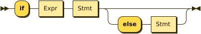

#### while

`while` is a (breakable) loop. Given a condition, the condition is checked on every iteration (except the first), and if false, the loop is returned from.

```
let a = 0;
while a < 5 {
outs("Meow!");
a++;
}
```

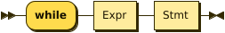

#### break

A `while`, `for` or `foreach` block may be escaped with `break`. (In `foreach`'s case this does not actually terminate the loop but prevents the contents from executing until the loop completes, which is effectively the same thing but less efficient.)

```
while true {
if calculateImportantCondition() {
break;
} else {
handleStuff();
}
}
```


#### for

`for` loops consist of initial variables (as in a `let` statement), a condition, an adjustment statement, and finally a loop body.

They're essentially fancy syntax for a `while` loop with some rearranging.

```
for a = 1; a <= 10; a++; {
// some code here
}
```

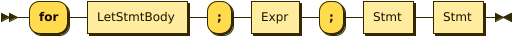

#### foreach

`foreach` blocks handle the different types of agent iteration.

The `foreach` block details are surrounded by `()`.

In most cases, the supplied type (such as `Agent`) is used to supply the classifier, though one may be explicitly supplied.

With `econ` a supplied agent is used (as that's how `econ` works).

Within the `foreach` block, `targ` is initially set to the current agent, and is retyped to the supplied type.

```
// enum/epas/esee/etch
foreach (Agent in enum) {
}
// enum/epas/esee/etch with explicit classifier
foreach (Agent in enum 0, 0, 0) {
}
// econ
foreach (Agent in econ targ) {
}
```

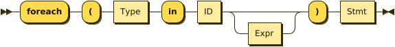

#### with

A `with` block checks if a given variable (or something like a variable, such as `targ`) is of a given type (where said type must be a class) and if so, runs the code within. Otherwise, said code is not run.

Notably, `null` is not considered to be of the type.

This is of the form `with (TYPE VAR) STATEMENT` - though `with TYPE VAR STATEMENT` is allowed.

The code within has the variable automatically alias-casted to the target type.

As this is in effect an `if` statement, it supports `else`.
It is in fact equivalent to `if (VAR instanceof TYPE) { alias VAR!TYPE; STATEMENT } else STATEMENT`.

```
with (Bramboo targ) {
// Bramboo. Do stuff with it!
doStuffWithBramboo(targ);
} else {
// Not bramboo!
}
```

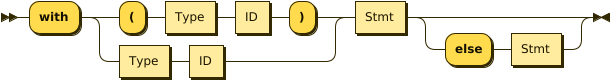
